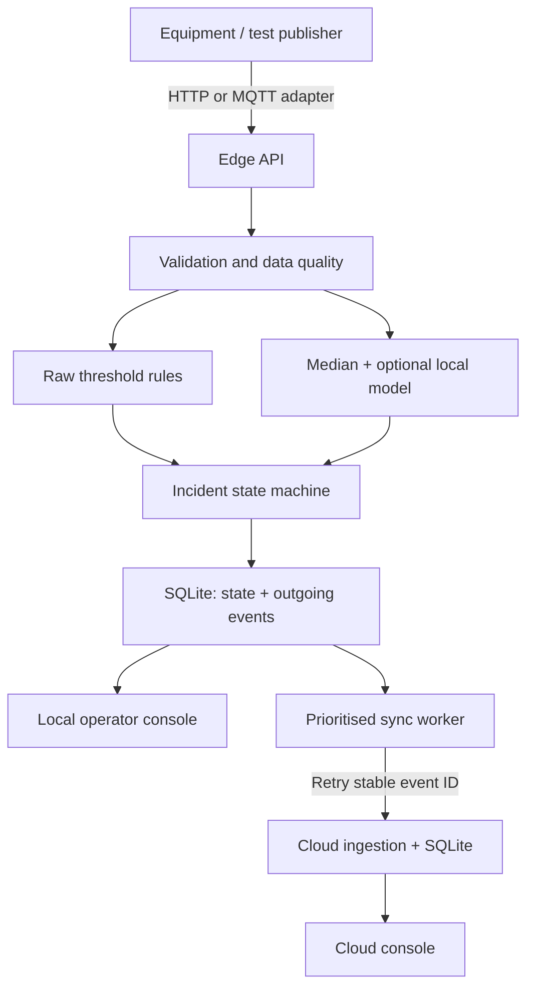

# Architecture and decisions

## Decisions

1. A single Python process per node, one SQLite connection per operation, and a process lock keep transactions simple. No extra workers: multi-process queue leasing is not implemented.
2. Domain logic is independent of FastAPI so failure behaviour can be tested without a network.
3. Sensors are classified individually. Fresh critical temperature still alerts when vibration is unavailable. Missing data suspends statistical inference; no invented certainty through indefinite imputation.
4. Critical rule violations open immediately. Warning conditions require three consecutive readings. Five complete normal readings mark recovery. The shared warning streak counts any warning, not necessarily the same feature.
5. One active incident per machine groups ongoing abnormal behaviour. New abnormal readings reopen a recovered, unclosed incident. The captured evidence window belongs to the first trigger; later recurrences append state transitions, not another full recording window. A new incident begins after closure.
6. Incident updates and outgoing events commit atomically. The first event omits the evidence window to reduce notification size. Later evidence and operator actions are versioned snapshots. Cloud ignores older snapshots while acknowledging their transport event IDs.
7. Cloud receipt plus materialised state update are atomic. A lost response causes a retry rather than data deletion at the edge. Delivery is at least once, with deduplicated application; it is not an exactly-once network guarantee.
8. Raw history is finite. Incident evidence survives raw-history eviction because it is copied into the incident record. Interrupted captures are visibly incomplete; restart does not reconstruct periods when the process was stopped.
9. Routine summaries are low priority. Under queue pressure they can be removed. A queue consisting entirely of important events produces explicit backpressure instead of silent incident loss. This is a finite-storage boundary to discuss during evaluation.
10. Raw thresholds are never delayed by smoothing. The optional median filter affects ML only. Training, calibration, holdout and runtime share the same causal filter. The model threshold is the 0.5th percentile of score_samples on separate normal calibration data. The displayed score is raw score minus threshold. Model artifacts are local/trusted and machine-bound; synthetic origin and model version are retained in incident reasons.

## Version 0.1 security boundary

The default launcher binds only loopback. All state reads and writes require a configured node key; UI files and health are public. Cloud sync can use `EDGEGUARD_CLOUD_KEY` when separately provisioning nodes. The v0.1 operator and ingestion roles share a key; production separation is pending. No HTML injection from operator text: React renders it as text. Secrets are never committed.

## Resource boundary

Counts are bounded on edge storage and responses list only 200 recent incidents / 100 queue items. Detailed incident evidence can make polling expensive at high incident volumes; a paginated detail API is a future improvement. Cloud receipt retention needs an administrative policy. CPU/memory limits in Compose must be validated on the intended edge hardware. Event backoff caps at 30 seconds without jitter; multiple edge nodes would need jitter and node-scoped IDs.

## Operations console and observable requirements

The local overview is now an operations console: receive → validate → decide → preserve → synchronise. Each stage links to its underlying records. Cloud views continue reading only their own database.

| Requirement | Implementation | Visible evidence |
|---|---|---|
| Noisy/incomplete input | Per-sensor validation; causal median for complete ML inputs; raw rules bypass smoothing | Raw/filtered chart, gaps, quality flags |
| Abnormal behaviour | Immediate critical rules; three-reading warning persistence; optional machine-bound Isolation Forest | Incident reasons, model origin/version, source measurements |
| Urgency | P3 critical, P2 warnings/operator updates, P1 evidence, P0 routine summaries | Queue counts and bytes per priority |
| Transmission reduction | Fifteen-second valid-value summaries with latest snapshot | Baseline versus actual payload bytes; retry bytes separately |
| Offline detection | Ingestion and detection require no cloud response | Offline hero, session counters for accepted/critical readings during observed outage |
| Local buffering | Transactional incident/outbox SQLite writes, bounded queue, routine eviction first | Pending records, age, bytes, explicit dropped events/backpressure |
| Synchronisation | Stable IDs, acknowledgements, retries, version checks | Persisted event ledger and connection-transition journal |
| Resource limits | Upload pacing, bounded histories/queues; CPU/RSS/latency sampling; Compose CPU/RAM caps | Measured CPU, RAM, processing p95 and configured payload budget |

Runtime CPU is process CPU relative to one core and can exceed 100% on multithreaded native runs. Memory budget is an indicator on native Python; only Compose configures OS limits. Upload pacing spaces send starts by payload bytes/budget, permits one event burst, and includes retry traffic. It is not link-level traffic shaping: HTTP/TLS overhead is excluded. A large evidence burst can delay a later notification until the current pacing debt clears. Counters for offline readings reset on process restart; the connection journal and transport records persist. An outage is observed after a failed cloud request, so those counters do not establish the exact physical disconnection time.

Scenario Lab is authenticated and enabled only by EDGEGUARD_ENABLE_FAULTS=1. It produces explicitly synthetic inputs using the same domain ingestion path and never uses a real-equipment-calibrated model. Cloud controls forward to the cloud's fault endpoint; real ingestion failures, SQLite persistence and retry semantics remain active. Fault controls are for exercising this pilot, not industrial control. A stopped publisher eventually produces a stale stream.

### Remaining validation

Hardware calibration, representative fleet load, long outage storage limits, Windows resource sampling and Compose/MQTT runtime need validation on the target installation. No interface badge constitutes a certification or a passing test. ML robustness limitations remain documented in ml-report.md.

## Efficiency policy update

The sync worker claims an outbox item before sending, gzip-compresses when beneficial, then accounts/paces using actual transmitted body bytes. A bounded gzip decoder rejects malformed streams and expansion beyond the original 256 KiB API limit. Restart clears in-flight claims for at-least-once retry; a single worker per database remains mandatory.

Unattempted, unclaimed routine summaries for one machine may be replaced by a newer summary in the same transaction. Earlier coverage is explicitly SUPERSEDED, not merged or delivered. Incident records are retained independently. Attempted summaries are exempt from coalescing; existing queue-pressure eviction of routine traffic is still possible. Retry backoff has 50–100% equal jitter under a 30-second cap. Reserved critical bandwidth and byte-budget storage enforcement remain future work.

The measured experiment is isolated from operational data and cloud fault modes. It uses the production Store, SyncWorker, cloud API, decompressor and idempotency path with temporary databases. It uses explicit synthetic sensor time, tests rules only and persists its report in the operational database. A running report interrupted by restart becomes NOT_OBSERVED.
