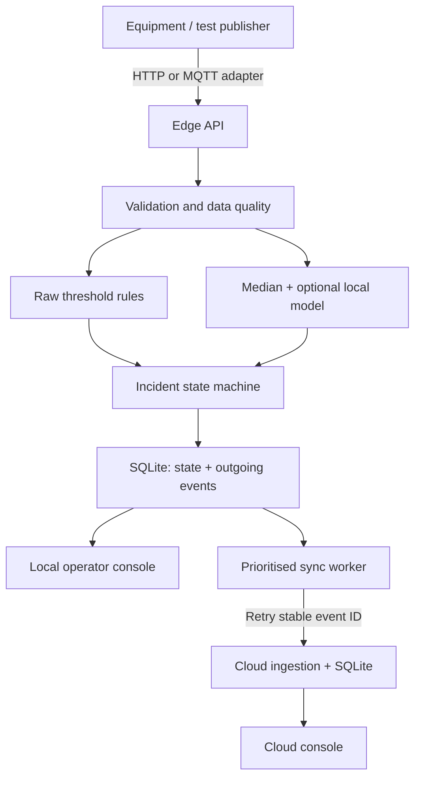

# Architecture and decisions

## Decisions

1. A single Python process per node, one SQLite connection per operation, and a process lock keep transactions simple. No extra workers: multi-process queue leasing is not implemented.
2. Domain logic is independent of FastAPI so failure behaviour can be tested without a network.
3. Sensors are classified individually. Fresh critical temperature still alerts when vibration is unavailable. Missing data suspends statistical inference; no invented certainty through indefinite imputation.
4. Critical rule violations open immediately. Warning conditions require three consecutive readings. Five complete normal readings mark recovery. The shared warning streak counts any warning, not necessarily the same feature.
5. One active incident per machine groups ongoing abnormal behaviour. New abnormal readings reopen a recovered, unclosed incident. The captured evidence window belongs to the first trigger; later recurrences append state transitions, not another full recording window. A new incident begins after closure.
6. Incident updates and outgoing events commit atomically. The first event omits the evidence window to reduce notification size. Later evidence and operator actions are versioned snapshots. Cloud ignores older snapshots while acknowledging their transport event IDs.
7. Cloud receipt plus materialised state update are atomic. A lost response causes a retry rather than data deletion at the edge. Delivery is at least once, with deduplicated application; it is not an exactly-once network guarantee.
8. Raw history is finite. Incident evidence survives raw-history eviction because it is copied into the incident record. Interrupted captures are visibly incomplete; restart does not reconstruct periods when the process was stopped.
9. Routine summaries are low priority. Under queue pressure they can be removed. A queue consisting entirely of important events produces explicit backpressure instead of silent incident loss. This is a finite-storage boundary to discuss during evaluation.
10. Raw thresholds are never delayed by smoothing. The optional median filter affects ML only. Model artifacts are local/trusted and machine-bound.

## Version 0.1 security boundary

The default launcher binds only loopback. All state reads and writes require a configured node key; UI files and health are public. Cloud sync can use `EDGEGUARD_CLOUD_KEY` when separately provisioning nodes. The v0.1 operator and ingestion roles share a key; production separation is pending. No HTML injection from operator text: React renders it as text. Secrets are never committed.

## Resource boundary

Counts are bounded on edge storage and responses list only 200 recent incidents / 100 queue items. Detailed incident evidence can make polling expensive at high incident volumes; a paginated detail API is a future improvement. Cloud receipt retention needs an administrative policy. CPU/memory limits in Compose must be validated on the intended edge hardware. Event backoff caps at 30 seconds without jitter; multiple edge nodes would need jitter and node-scoped IDs.
